# Architecture Diagrams (Verified)

> **View these diagrams:** Install VS Code extension "Markdown Preview Mermaid Support", then press `Ctrl+Shift+V` to preview.
>
> Or paste into: https://mermaid.live/

---

## File-to-Diagram Mapping

| File | Location | Contains | Diagrams |
|------|----------|----------|----------|
| `models.py` (common) | `src/common/models.py` | `TradeSide`, `SourceType`, `TradeEvent`, `TradeAggregate` | #10, #6 |
| `models.py` (domain) | `src/ingestion/domain/models.py` | `RawEvent`, `EnrichedTradeEvent`, `SourceMetadata` | #10, #2 |
| `manager.py` | `src/ingestion/manager.py` | #3, #2 |
| `base.py` (connector) | `src/ingestion/adapters/connectors/base.py` | #3, #9 |
| `websocket.py` | `src/ingestion/adapters/connectors/websocket.py` | #3 |
| `batch.py` | `src/ingestion/adapters/connectors/batch.py` | #3 |
| `base.py` (adapter) | `src/ingestion/adapters/formats/base.py` | #3, #2 |
| `handlers.py` | `src/ingestion/pipeline/handlers.py` | #4 |
| `builder.py` | `src/ingestion/pipeline/builder.py` | #4 |
| `circuit_breaker.py` | `src/ingestion/resilience/circuit_breaker.py` | #5 |
| `ingestion_port.py` | `src/ingestion/ports/ingestion_port.py` | #9 |
| `publisher_port.py` | `src/ingestion/ports/publisher_port.py` | #9 |
| `metrics_port.py` | `src/ingestion/ports/metrics_port.py` | #9 |
| `windowed_aggregator.py` | `src/consumer/windowed_aggregator.py` | #6 |
| `kafka_consumer.py` | `src/consumer/kafka_consumer.py` | #6, #7 |
| `kafka_utils.py` | `src/common/kafka_utils.py` | `DeliveryCallbackMixin` | #7, #11 |
| `kafka_producer.py` | `src/producer/kafka_producer.py` | #7 |
| `docker-compose-full.yml` | `docker-compose-full.yml` | #1, #8 |
| `config.py` | `src/config.py` | #8 |

---

## 1. System Overview (C4 Context Level)

**Files:** `docker-compose-full.yml`

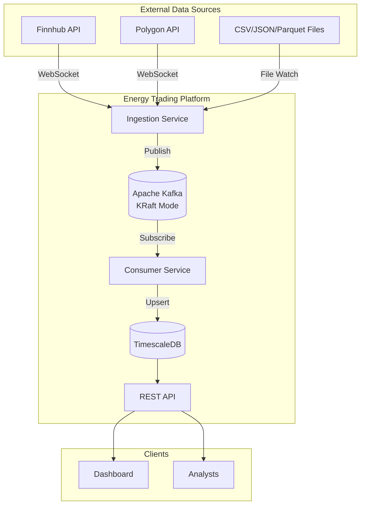

---

## 2. Data Flow (Sequence)

**Files:** `manager.py`, `base.py`, `handlers.py`, `models.py`

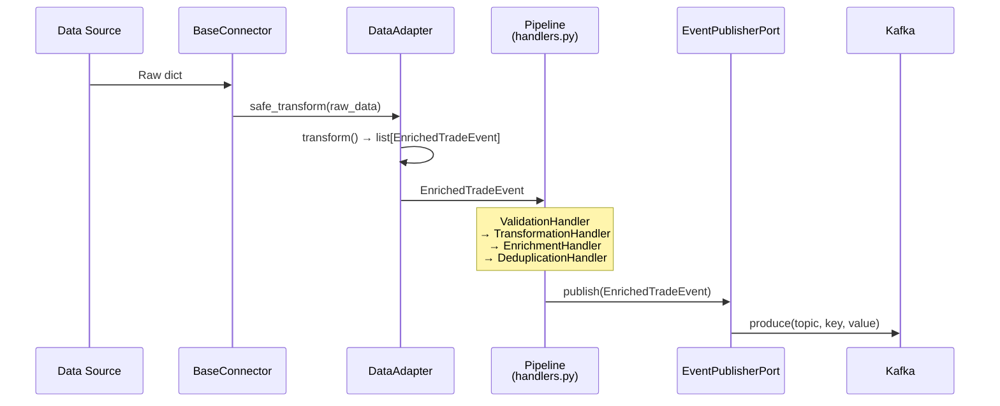

---

## 3. Ingestion Service Components

**Files:** `manager.py:27-376`, `base.py:22-261`, `websocket.py`, `batch.py`, `base.py` (formats)

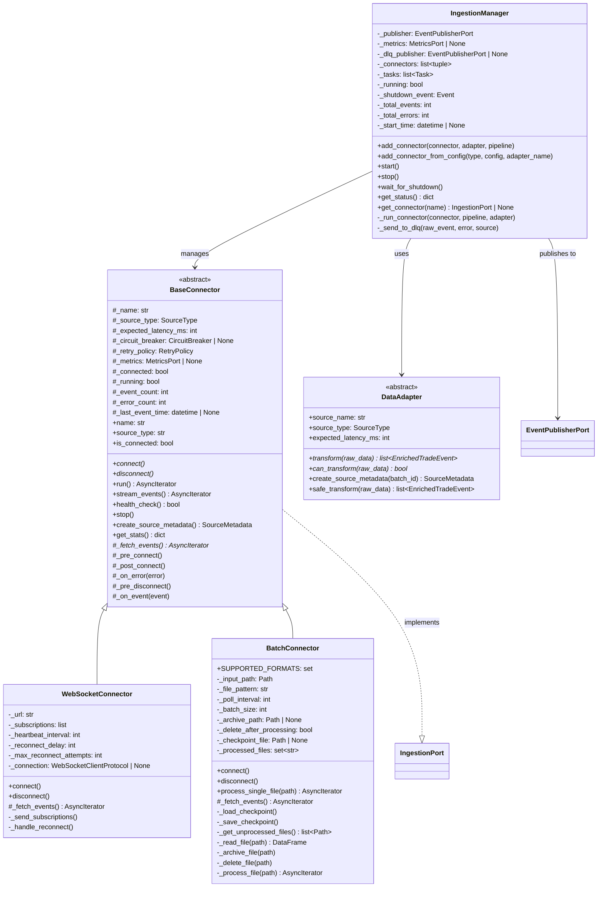

---

## 4. Pipeline Handlers (Chain of Responsibility)

**Files:** `handlers.py:31-390`, `builder.py:20-260`

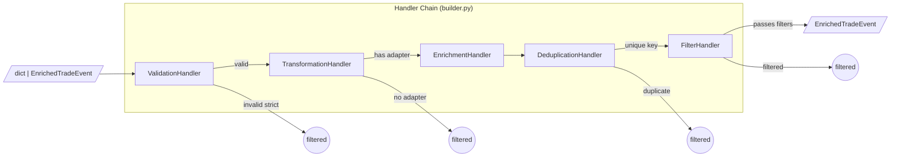

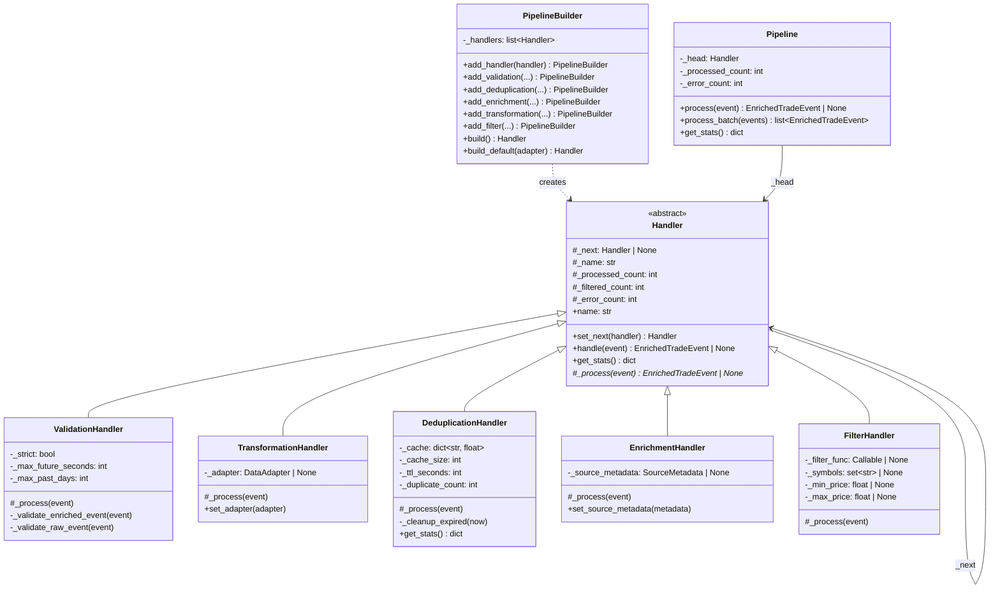

---

## 5. Circuit Breaker State Machine

**Files:** `circuit_breaker.py:44-259`

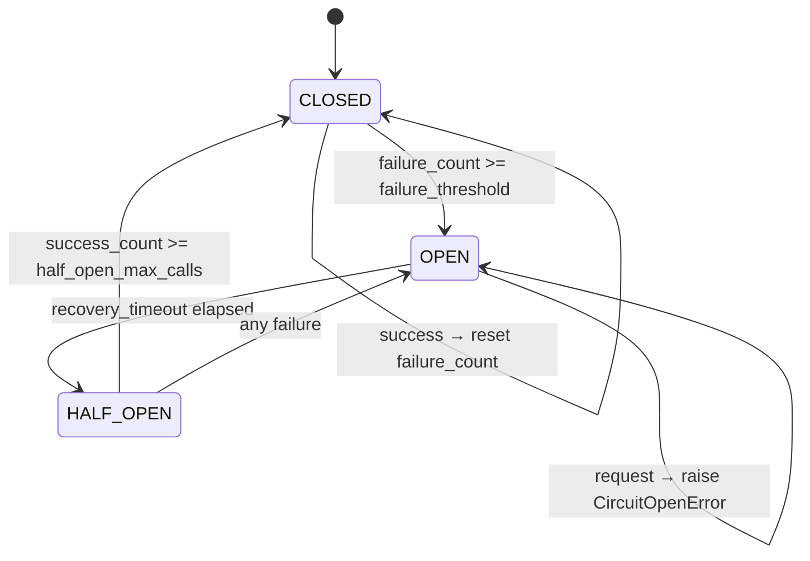

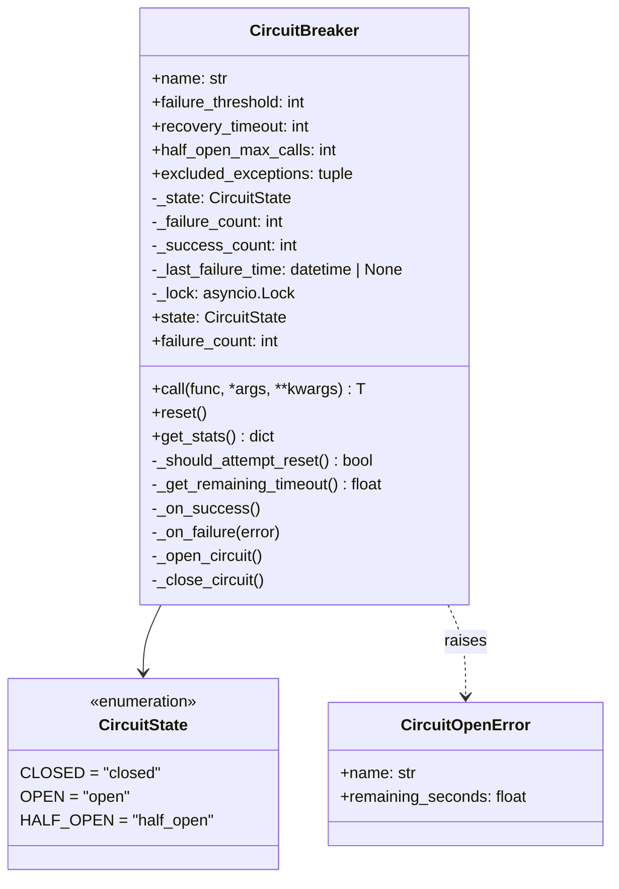

---

## 6. Consumer Windowed Aggregation

**Files:** `windowed_aggregator.py:23-473`, `kafka_consumer.py`, `common/models.py:51-126, 128-206`

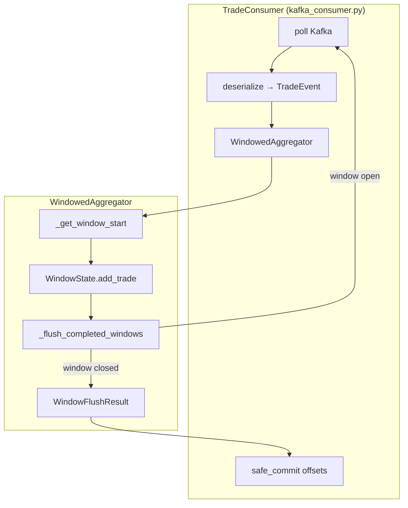

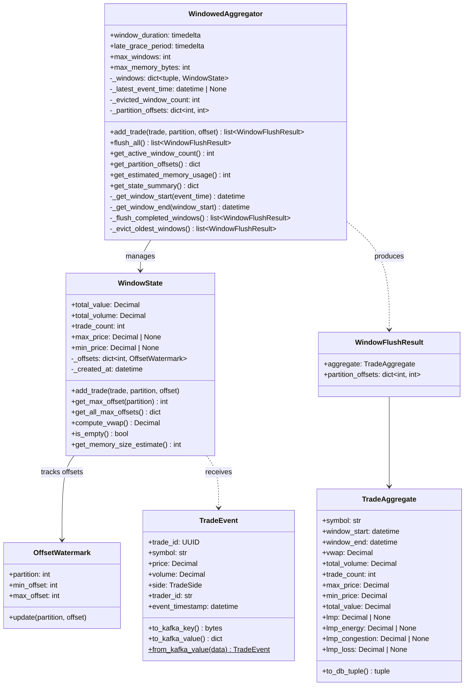

**VWAP Calculation:**
```
VWAP = Σ(Price × Volume) / Σ(Volume)

Example (1-minute window):
  Trade 1: AAPL $175.00 × 100 shares = $17,500
  Trade 2: AAPL $176.00 × 200 shares = $35,200
  Trade 3: AAPL $174.00 × 150 shares = $26,100

  Total Value  = $78,800
  Total Volume = 450 shares
  VWAP = $78,800 / 450 = $175.11
```

---

## 7. Kafka Topic Partitioning

**Files:** `kafka_utils.py:19-111`, `kafka_producer.py`, `config.py:85-120`

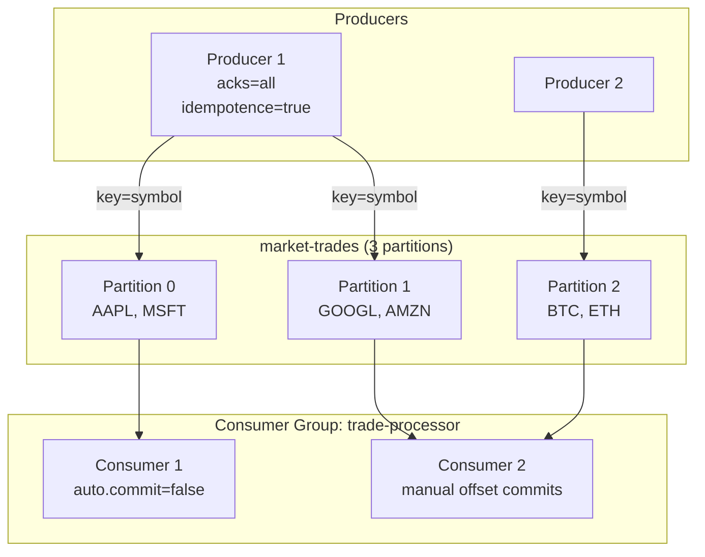

**Producer Config** (`kafka_utils.py:19-63`):
```python
{
    "acks": "all",                    # All replicas acknowledge
    "enable.idempotence": True,       # Exactly-once producer
    "compression.type": "lz4",        # Fast compression
    "linger.ms": 5,                   # Batch small messages
}
```

**Consumer Config** (`kafka_utils.py:66-111`):
```python
{
    "enable.auto.commit": False,      # Manual commits only
    "auto.offset.reset": "earliest",  # Start from beginning
    "max.poll.interval.ms": 300000,   # 5 min processing time
}
```

---

## 8. Deployment Modes

**Files:** `docker-compose-full.yml`, `config.py:15-28`

```mermaid
flowchart TB
    subgraph LOCAL["LOCAL Mode (--profile local)"]
        L_PROD[producer<br/>Synthetic Data] --> L_KAFKA[Kafka]
        L_KAFKA --> L_CONS[consumer]
        L_CONS --> L_DB[(TimescaleDB)]
    end

    subgraph REALTIME["REALTIME Mode (--profile realtime)"]
        R_API[Finnhub/Polygon<br/>WebSocket] --> R_ING[ingestion]
        R_ING --> R_KAFKA[Kafka]
        R_KAFKA --> R_CONS[consumer]
        R_CONS --> R_DB[(TimescaleDB)]
    end

    subgraph BATCH["BATCH Mode (--profile batch)"]
        B_FILE[CSV/Parquet<br/>Files] --> B_BATCH[batch-processor]
        B_BATCH --> B_KAFKA[Kafka]
        B_KAFKA --> B_CONS[consumer]
        B_CONS --> B_DB[(TimescaleDB)]
    end

    subgraph HYBRID["HYBRID Mode (--profile hybrid)"]
        H_API[External APIs] --> H_ING[ingestion]
        H_FILE[Files] --> H_ING
        H_ING --> H_KAFKA[Kafka]
        H_KAFKA --> H_CONS[consumer]
        H_CONS --> H_DB[(TimescaleDB)]
    end
```

**IngestionMode Enum** (`config.py:15-28`):
```python
class IngestionMode(str, Enum):
    LOCAL = "local"       # Synthetic data only
    REALTIME = "realtime" # External APIs only
    BATCH = "batch"       # File processing only
    HYBRID = "hybrid"     # APIs + files
```

---

## 9. Hexagonal Architecture (Ports & Adapters)

**Files:** `ports/ingestion_port.py`, `ports/publisher_port.py`, `ports/metrics_port.py`, `base.py`

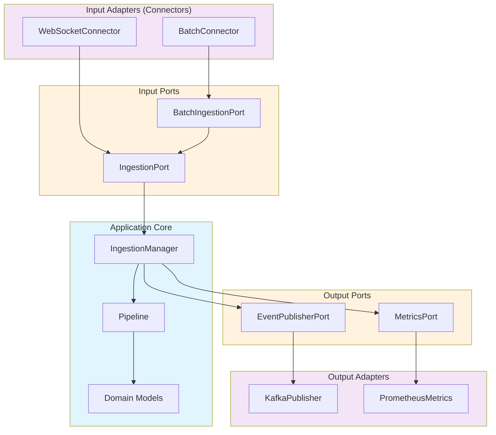

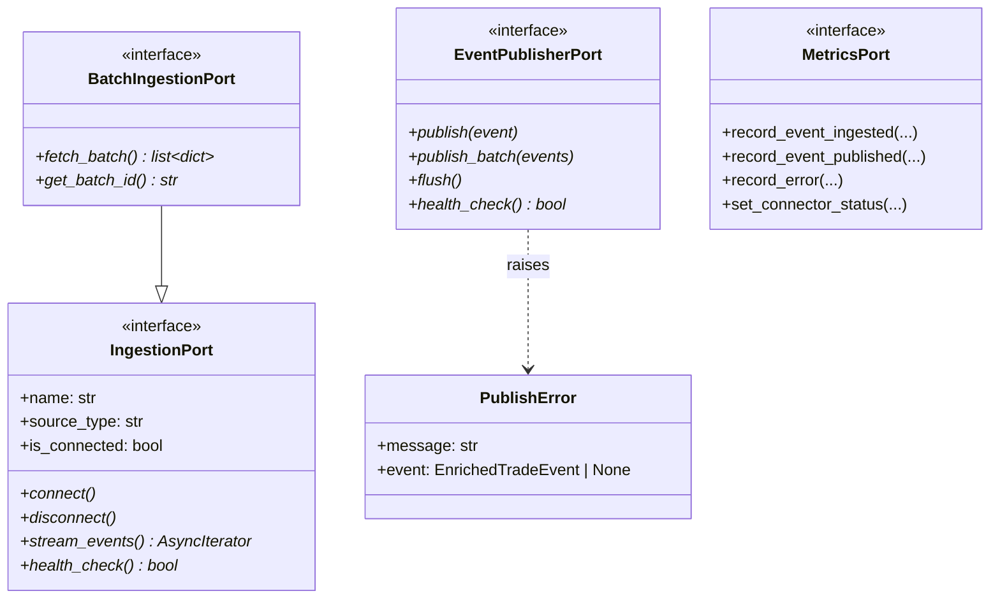

---

## 10. Domain Models

**Files:**
- `src/common/models.py` - Shared enums (`SourceType`, `TradeSide`) and core models (`TradeEvent`, `TradeAggregate`)
- `src/ingestion/domain/models.py` - Ingestion-specific models (`RawEvent`, `EnrichedTradeEvent`, `SourceMetadata`)

> **Note:** `SourceType` and `TradeSide` are defined ONLY in `common/models.py` and imported elsewhere (DRY principle).

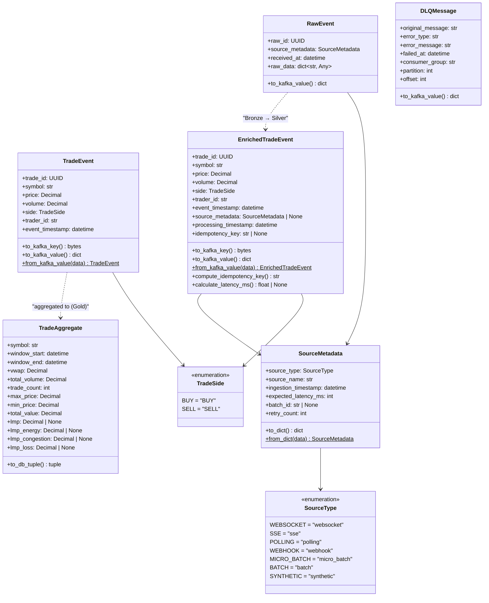

---

## Data Flow Summary

```
┌─────────────────────────────────────────────────────────────────────────────┐
│                           MEDALLION ARCHITECTURE                            │
├─────────────────────────────────────────────────────────────────────────────┤
│                                                                             │
│  ┌─────────────┐    ┌─────────────┐    ┌─────────────┐    ┌─────────────┐  │
│  │   BRONZE    │───▶│   SILVER    │───▶│    GOLD     │───▶│   SERVING   │  │
│  │  (Raw)      │    │  (Clean)    │    │ (Aggregate) │    │   (Query)   │  │
│  └─────────────┘    └─────────────┘    └─────────────┘    └─────────────┘  │
│                                                                             │
│  RawEvent           EnrichedTradeEvent  TradeAggregate    REST API         │
│  • raw_data         • validated         • vwap            • /trades        │
│  • source_metadata  • deduplicated      • total_volume    • /aggregates    │
│                     • enriched          • trade_count     • /symbols       │
│                                                                             │
│  Files:             Files:              Files:            Files:           │
│  connectors/        handlers.py         windowed_         api/             │
│  base.py            builder.py          aggregator.py                      │
│                                                                             │
└─────────────────────────────────────────────────────────────────────────────┘
```

---

## 11. DeliveryCallbackMixin (Template Method Pattern)

**File:** `src/common/kafka_utils.py`

> **Pattern:** Template Method - defines the skeleton of the delivery callback algorithm, allowing subclasses to customize specific steps via hooks.

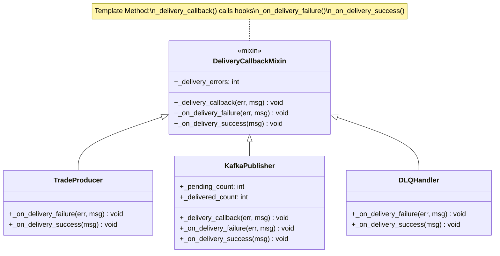

**Benefits:**
- Single source of truth for callback structure
- Consistent error tracking (`_delivery_errors`)
- Subclasses only implement custom behavior (metrics, logging)
- Easy to test - mock the hooks
