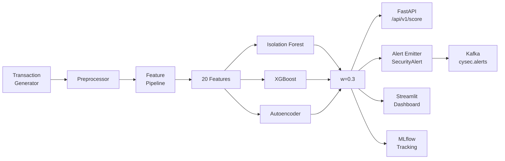

# Fraud & Anomaly Detection Engine

ML-driven real-time fraud detection for financial transactions. Combines unsupervised anomaly detection (Isolation Forest, Autoencoder) with supervised classification (XGBoost) in a weighted ensemble that outperforms individual models.

## Problem Statement

Financial fraud detection faces a fundamental tension: catching fraud (recall) while minimizing false alarms (precision) on heavily imbalanced data (~3% fraud rate). This engine addresses it with:

- **Multi-strategy synthetic data** — 5 distinct fraud patterns (amount spikes, new device+location, rapid succession, round amounts, category mismatch)
- **20 engineered features** capturing transaction, behavioral, and network signals
- **3-model ensemble** — each model catches different fraud patterns, weighted combination maximizes AUC-PR
- **Explainable predictions** — every score includes top-3 contributing features

## Architecture



**Data flow:** Raw transactions → preprocessing (log-transform, encode categoricals) → feature engineering (transaction + behavioral + network) → model scoring → ensemble fusion → API response + alert emission

## Feature Engineering

| Category | Features | Signal |
|----------|----------|--------|
| **Preprocessor** | `amount_log`, `merchant_category_code` | Normalized amount, encoded category |
| **Transaction** | `amount_zscore`, `is_round_amount`, `hour_of_day`, `day_of_week`, `is_weekend`, `is_night`, `merchant_risk_score` | Per-transaction anomaly indicators |
| **Behavioral** | `tx_count_1h`, `tx_count_24h`, `avg_amount_7d`, `amount_deviation`, `unique_merchants_24h`, `time_since_last_tx`, `is_new_category_for_user` | User spending patterns and velocity |
| **Network** | `shared_device_count`, `unique_ips_24h`, `is_new_device_for_user`, `geo_distance_from_home` | Device/IP/location anomalies |

**No data leakage:** `merchant_risk_score` and `amount_deviation` use expanding mean with `shift(1)` — only past data is used.

## Model Comparison

| Model | Type | Approach | Strengths |
|-------|------|----------|-----------|
| **Isolation Forest** | Unsupervised | Random partitioning anomaly isolation | No labels needed, catches novel patterns |
| **XGBoost** | Supervised | Gradient-boosted trees with class weights | Highest precision, feature importance |
| **Autoencoder** | Semi-supervised | PyTorch (input→64→32→64→input), trained on normal only | Catches subtle pattern deviations |
| **Ensemble** | Combined | Weighted: IF=0.2, XGB=0.5, AE=0.3 | Outperforms individuals on AUC-PR |

All models implement `BaseDetector` ABC: `fit()`, `predict()`, `score()`, `explain()`.

## Evaluation Metrics

Primary metric: **AUC-PR** (area under precision-recall curve) — appropriate for imbalanced datasets where ROC-AUC can be misleading.

| Metric | Description |
|--------|-------------|
| AUC-PR | Primary ranking metric |
| F1 Score | Harmonic mean of precision/recall |
| Precision | Fraction of flagged transactions that are actually fraud |
| Recall | Fraction of actual fraud that is detected |
| FPR | False positive rate |
| Value-at-Risk | Fraud dollar amount detected vs. missed |

HTML evaluation reports include precision-recall curves, confusion matrices, and feature importance charts. MLflow tracks all experiments with hyperparameters, metrics, and artifacts.

## API

Base URL: `http://localhost:8000`

| Method | Endpoint | Description |
|--------|----------|-------------|
| `POST` | `/api/v1/score` | Score a single transaction |
| `POST` | `/api/v1/batch` | Score a batch of transactions |
| `GET` | `/api/v1/model-info` | Model metadata and feature list |
| `GET` | `/api/v1/stats` | Scoring statistics |
| `GET` | `/health` | Health check |

### Score a transaction

```bash
curl -X POST http://localhost:8000/api/v1/score \
  -H "Content-Type: application/json" \
  -d '{
    "transaction_id": "tx-001",
    "features": {
      "amount_log": 5.2,
      "merchant_category_code": 3,
      "amount_zscore": 2.1,
      "is_round_amount": 1,
      "hour_of_day": 3,
      "day_of_week": 6,
      "is_weekend": 1,
      "is_night": 1,
      "merchant_risk_score": 0.08,
      "tx_count_1h": 5,
      "tx_count_24h": 12,
      "avg_amount_7d": 150.0,
      "amount_deviation": 3.2,
      "unique_merchants_24h": 4,
      "time_since_last_tx": 120.0,
      "is_new_category_for_user": 1,
      "shared_device_count": 1,
      "unique_ips_24h": 3,
      "is_new_device_for_user": 1,
      "geo_distance_from_home": 500.0
    }
  }'
```

Response:
```json
{
  "transaction_id": "tx-001",
  "fraud_score": 0.8234,
  "is_fraud": true,
  "explanation": [
    {"feature": "geo_distance_from_home", "contribution": 0.342},
    {"feature": "amount_deviation", "contribution": 0.218},
    {"feature": "is_new_device_for_user", "contribution": 0.156}
  ]
}
```

## Setup

### Prerequisites

- Python 3.13+
- conda
- Docker (optional, for containerized deployment)

### Local development

```bash
# Create and activate conda environment
conda create -n cysec python=3.13 -y
conda activate cysec

# Install cysec-shared (from CysecAI root)
pip install -e ../cysec-shared

# Install project with dev dependencies
pip install -e ".[dev]"

# Run quality checks
ruff check src/ tests/
ruff format --check src/ tests/
mypy src/ --strict
pytest tests/ -v --cov=src
```

### Docker

```bash
# From FraudAndAnomaly directory
docker compose up -d

# Services:
#   API:       http://localhost:8000
#   Dashboard: http://localhost:8501
#   MLflow:    http://localhost:5000

# Health check
curl http://localhost:8000/health
```

## Project Structure

```
FraudAndAnomaly/
├── src/
│   ├── config.py                  # Pydantic settings
│   ├── data/
│   │   ├── generator.py           # Synthetic transaction generator
│   │   └── preprocessor.py        # Log-transform, encoding
│   ├── features/
│   │   ├── transaction.py         # Per-transaction features
│   │   ├── behavioral.py          # Per-user velocity/patterns
│   │   ├── network.py             # Device/IP/geo features
│   │   └── pipeline.py            # Feature pipeline orchestrator
│   ├── models/
│   │   ├── base.py                # BaseDetector ABC
│   │   ├── isolation_forest.py    # Unsupervised detector
│   │   ├── xgboost_model.py       # Supervised detector
│   │   ├── autoencoder.py         # Semi-supervised (PyTorch)
│   │   └── ensemble.py            # Weighted ensemble
│   ├── evaluation/
│   │   ├── metrics.py             # AUC-PR, F1, confusion matrix
│   │   ├── reporter.py            # HTML report generator
│   │   └── tracker.py             # MLflow experiment tracking
│   ├── alerts/
│   │   └── emitter.py             # SecurityAlert → Kafka
│   ├── api/
│   │   ├── main.py                # FastAPI application
│   │   └── schemas.py             # Request/response models
│   └── dashboard/
│       └── app.py                 # Streamlit dashboard
├── tests/
│   └── unit/                      # 145 tests, >90% coverage
├── Dockerfile
├── docker-compose.yml
└── pyproject.toml
```

## Quality Gate

| Check | Target | Status |
|-------|--------|--------|
| `ruff check` | Zero errors | Pass |
| `ruff format --check` | No changes | Pass |
| `mypy --strict` | Zero errors | Pass |
| `pytest --cov` | >80% coverage | Pass (90.7%) |
| Test count | — | 145 passing |

## Limitations

- **Synthetic data only** — generator produces realistic patterns but may not capture all real-world fraud dynamics. Production deployment would require training on actual transaction data.
- **No online learning** — models are trained offline. Concept drift (changing fraud patterns) requires periodic retraining.
- **Single-node inference** — API runs on a single process. Production scale would need horizontal scaling behind a load balancer.
- **No model versioning in API** — the API serves one model at a time. A/B testing or canary deployments would require a model serving layer (e.g., MLflow Model Serving).
- **Autoencoder threshold sensitivity** — the 95th percentile threshold on reconstruction error is sensitive to the training data distribution. Production use should monitor threshold stability.
- **Alert emission is fire-and-forget** — Kafka producer errors are logged but not retried with guaranteed delivery.
