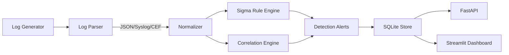

# SecurityDataPipeline — SIEM Detection Engine

A Python-based SIEM detection engine that ingests, normalizes, correlates, and alerts on security events. Features multi-format log parsing, Sigma-compatible rule engine, multi-event correlation, SQLite storage, REST API, and Streamlit SOC dashboard.

## Architecture



**Pipeline flow:** Raw logs are auto-detected (JSON, Syslog RFC 3164, CEF), parsed, and normalized to an ECS-aligned `NormalizedEvent` schema. Events pass through both the Sigma rule engine (single-event pattern matching) and the correlation engine (multi-event time-windowed patterns). Resulting alerts are stored in SQLite and queryable via REST API and dashboard.

## Key Features

| Feature | Description |
|---------|------------|
| **Multi-format parsing** | JSON, Syslog (RFC 3164), CEF — auto-detected |
| **ECS-aligned normalization** | All formats map to a common NormalizedEvent schema |
| **Sigma rule engine** | YAML detection rules with field modifiers (equals, contains, startswith, gt, lt, re) |
| **Correlation engine** | Threshold (N events in window), sequence (A then B), cross-project patterns |
| **Cross-project alerts** | Ingests SecurityAlert from other CysecAI projects via cysec-shared |
| **SQLite storage** | Events + alerts with indexed queries, parameterized SQL |
| **REST API** | FastAPI — event/alert search, rule management, pipeline stats |
| **SOC dashboard** | Streamlit — overview, alert browser, event search, rule viewer, timeline |
| **Log generator** | Synthetic multi-source events with 4 attack sequence types |

## Detection Rules

### Sigma Rules (5 built-in)

| Rule ID | Attack | MITRE | Description |
|---------|--------|-------|-------------|
| sigma-bf-001 | Brute Force | T1110 | 5+ login failures within 10 min |
| sigma-pe-001 | Privilege Escalation | T1078 | Non-admin accessing admin endpoints |
| sigma-lm-001 | Lateral Movement | T1021 | Login success across 3+ hosts |
| sigma-de-001 | Data Exfiltration | T1048 | DNS queries to known-bad domains |
| sigma-dns-001 | DNS Tunneling | T1071 | Queries to malicious TLDs |

### Correlation Rules (3 built-in)

| Rule ID | Pattern | Window |
|---------|---------|--------|
| corr-bf-001 | Failed logins followed by success (same IP) | 10 min |
| corr-lm-001 | Same user authenticates to 3+ hosts | 1 hour |
| corr-xp-001 | Multiple security alerts from same IP | 5 min |

## API Endpoints

| Method | Path | Description |
|--------|------|-------------|
| GET | `/health` | Health check |
| GET | `/api/v1/events` | Search events (filter: src_ip, user, event_type) |
| GET | `/api/v1/alerts` | Search alerts (filter: severity, rule_id) |
| GET | `/api/v1/rules` | List loaded Sigma rules |
| POST | `/api/v1/rules` | Add Sigma rule from YAML |
| GET | `/api/v1/stats` | Pipeline + storage statistics |

```bash
# Example queries
curl http://localhost:8000/health
curl "http://localhost:8000/api/v1/alerts?severity=critical&limit=10"
curl "http://localhost:8000/api/v1/events?src_ip=10.0.0.1&limit=50"
curl -X POST http://localhost:8000/api/v1/rules \
  -H "Content-Type: application/json" \
  -d '{"yaml_content": "id: custom-001\ntitle: Custom Rule\nlevel: high\ndetection:\n  selection:\n    event_type|equals: login_failure\n  condition: selection"}'
```

## Log Format Support

**JSON** — Structured key-value log events
```json
{"event_id": "...", "source": "auth", "event_type": "login_failure", "src_ip": "10.0.0.1"}
```

**Syslog (RFC 3164)** — Traditional Unix syslog
```
Jan  1 12:00:00 server01 sshd[1234]: Failed password for admin from 10.0.0.1
```

**CEF (Common Event Format)** — ArcSight-compatible
```
CEF:0|SecurityVendor|Product|1.0|100|Login Failure|7|src=10.0.0.1 dst=192.168.1.1
```

## Setup

```bash
# Conda environment
conda activate cysec

# Install (editable)
pip install -e ".[dev]"

# Lint + type check
ruff check src/ tests/
mypy src/ --strict

# Tests (168 tests, >80% coverage)
pytest tests/ -v --cov=src

# API server
uvicorn src.api.main:app --reload --port 8000

# Dashboard
streamlit run src/dashboard/app.py

# Docker
docker compose up -d
```

## Project Structure

```
SecurityDataPipeline/
  pyproject.toml
  Dockerfile
  docker-compose.yml
  src/
    config.py                # GeneratorSettings, SIEMSettings
    data/generator.py        # Multi-source log generator (auth, firewall, DNS, app)
    ingestion/
      log_parser.py          # Auto-detect JSON/Syslog/CEF parser
      normalizer.py          # NormalizedEvent (ECS-aligned)
      alert_consumer.py      # SecurityAlert → NormalizedEvent
    detection/
      sigma_loader.py        # Sigma YAML parser (field|modifier syntax)
      rule_engine.py         # Dispatch-based field matching + condition evaluation
      correlation.py         # Threshold, sequence, cross-project patterns
    pipeline/processor.py    # EventProcessor: parse → normalize → detect → correlate
    storage/event_store.py   # SQLite events + alerts with indexed queries
    api/main.py              # FastAPI REST API
    dashboard/app.py         # Streamlit SOC dashboard
  rules/                     # 5 Sigma YAML detection rules
  tests/unit/                # 168 tests
```

## Quality Gate

| Check | Result |
|-------|--------|
| ruff check | 0 errors |
| ruff format | 0 changes |
| mypy --strict | 0 errors (20 source files) |
| pytest | 168 passed |
| Coverage | >80% |
| Performance | 10K gen/sec, >1K pipeline/sec, <200ms API |

## Limitations

- SQLite storage (single-writer) — suitable for development and moderate loads
- In-memory correlation buffers — not persisted across restarts
- No Kafka streaming in this build (Kafka integration planned via cysec-shared AlertConsumer)
- Sigma rule parser covers core modifiers, not the full Sigma 2.0 specification
- Dashboard Streamlit-based — suitable for SOC analyst workflows, not production SOC
