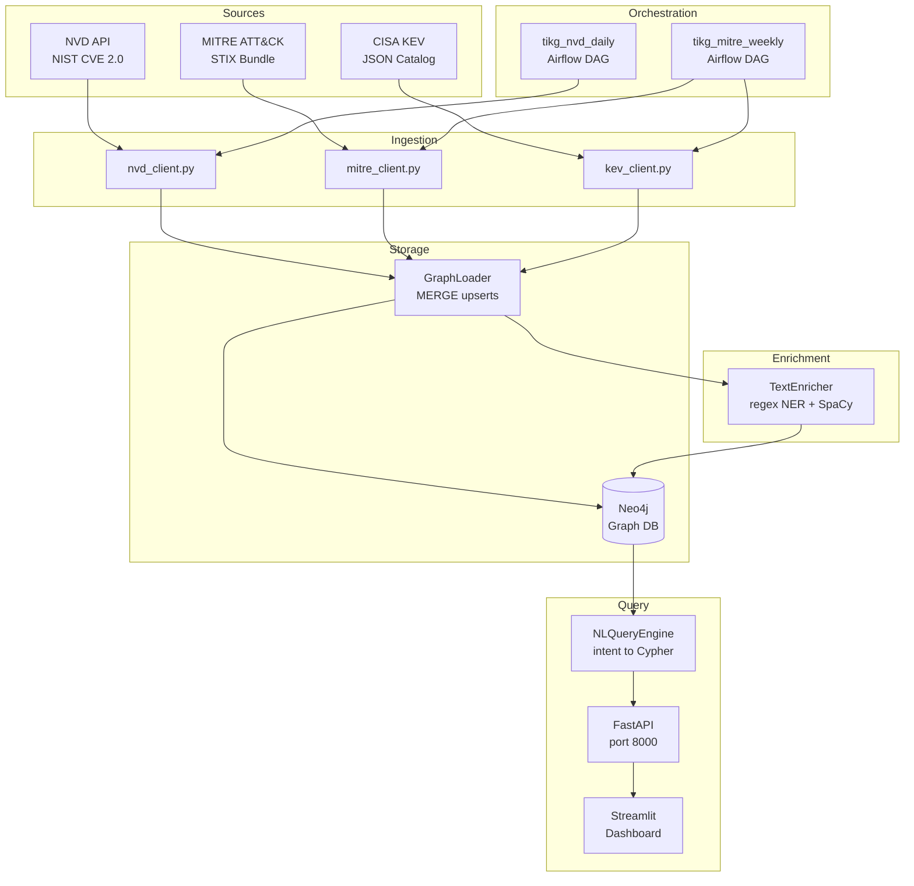

# Threat Intelligence Knowledge Graph (TIKG)

An AI-enriched knowledge graph that integrates CVE vulnerability data, MITRE ATT&CK techniques, and CISA KEV catalog entries into a queryable Neo4j graph. Supports natural-language-to-Cypher translation and is designed for security analysts who need to explore threat relationships without writing Cypher by hand.

**Stack:** Python 3.13 · Neo4j · FastAPI · Streamlit · Airflow · SpaCy (optional) · httpx · Pydantic v2

---

## Architecture



---

## Graph Schema

### Node Labels

| Label | Key Property | Description |
|-------|-------------|-------------|
| `CVE` | `cve_id` | NVD vulnerability entry with CVSS/EPSS scores |
| `CWE` | `cwe_id` | Common Weakness Enumeration |
| `AttackTechnique` | `technique_id` | MITRE ATT&CK technique (Txxxx) |
| `Software` | `node_id` | Vendor:product:version tuple from CPE data |
| `KEVEntry` | `cve_id` | CISA Known Exploited Vulnerability record |

### Relationships

| Relationship | From → To | Meaning |
|-------------|-----------|---------|
| `HAS_WEAKNESS` | CVE → CWE | Vulnerability class |
| `AFFECTS` | CVE → Software | Impacted products |
| `EXPLOITED_BY` | CVE → KEVEntry | Actively exploited in the wild |
| `EXPLOITS` | AttackTechnique → CVE | Technique targets this CVE |

### Uniqueness Constraints

```cypher
CREATE CONSTRAINT cve_id_unique IF NOT EXISTS FOR (n:CVE) REQUIRE n.cve_id IS UNIQUE
CREATE CONSTRAINT cwe_id_unique IF NOT EXISTS FOR (n:CWE) REQUIRE n.cwe_id IS UNIQUE
CREATE CONSTRAINT technique_id_unique IF NOT EXISTS
  FOR (n:AttackTechnique) REQUIRE n.technique_id IS UNIQUE
CREATE CONSTRAINT software_node_id_unique IF NOT EXISTS
  FOR (n:Software) REQUIRE n.node_id IS UNIQUE
CREATE CONSTRAINT kev_cve_id_unique IF NOT EXISTS
  FOR (n:KEVEntry) REQUIRE n.cve_id IS UNIQUE
```

---

## Project Structure

```
TIKG/
├── dags/
│   ├── tikg_nvd_daily.py       # Airflow: daily NVD ingest
│   └── tikg_mitre_weekly.py    # Airflow: weekly MITRE + KEV ingest
├── src/
│   ├── models.py               # Pydantic: CVE, CWE, AttackTechnique, Software, KEVEntry
│   ├── config.py               # TIKGSettings (Neo4j, NVD, MITRE, KEV sub-settings)
│   ├── ingestion/
│   │   ├── nvd_client.py       # NVD 2.0 REST API — paginated, rate-limited, reusable
│   │   ├── mitre_client.py     # MITRE ATT&CK STIX bundle from GitHub
│   │   └── kev_client.py       # CISA KEV JSON catalog
│   ├── graph/
│   │   ├── schema.py           # Constraint + index Cypher strings, node/rel constants
│   │   └── loader.py           # GraphLoader: MERGE-based upsert for all node types
│   ├── nlp/
│   │   └── enricher.py         # TextEnricher: regex NER (CVE, CWE, vendor, vuln type)
│   ├── query_engine/
│   │   └── nl_to_cypher.py     # NLQueryEngine: intent classification + Cypher templates
│   ├── api/
│   │   └── main.py             # FastAPI: /health, /api/v1/query, /api/v1/intents
│   └── dashboard/
│       └── app.py              # Streamlit: NL query tab, schema explorer, config view
├── tests/unit/                 # 142 tests, 93% coverage
├── docker-compose.yml          # Neo4j 5.25-community
└── pyproject.toml
```

---

## Setup

### Prerequisites

- Docker Desktop running
- conda env `cysec` (Python 3.13)

### 1. Start Neo4j

```bash
cd MarchQ2Q3/CysecAI/TIKG
docker compose up -d
# Neo4j browser: http://localhost:7474  (neo4j / password)
# Bolt:          bolt://localhost:7687
```

### 2. Install dependencies

```bash
conda activate cysec
pip install -e ".[dev]"
```

### 3. Configure environment

```bash
cp .env.example .env
# Edit .env — set NVD_API_KEY for higher rate limits (50 req/30s vs 5 req/30s without key)
```

### 4. Apply schema

```python
import asyncio
from neo4j import AsyncGraphDatabase
from src.graph.loader import GraphLoader

async def setup():
    driver = AsyncGraphDatabase.driver(
        "bolt://localhost:7687", auth=("neo4j", "password")
    )
    loader = GraphLoader(driver)
    await loader.apply_schema()
    await driver.close()

asyncio.run(setup())
```

### 5. Ingest data

```python
import asyncio
from neo4j import AsyncGraphDatabase
from src.ingestion.nvd_client import NVDClient
from src.ingestion.mitre_client import MITREClient
from src.ingestion.kev_client import KEVClient
from src.graph.loader import GraphLoader

async def ingest():
    driver = AsyncGraphDatabase.driver(
        "bolt://localhost:7687", auth=("neo4j", "password")
    )
    loader = GraphLoader(driver)

    async with NVDClient() as nvd:
        cves = await nvd.fetch_all()
        await loader.load_cve_batch(cves)

    async with MITREClient() as mitre:
        for technique in await mitre.fetch_techniques():
            await loader.load_technique(technique)

    async with KEVClient() as kev:
        for entry in await kev.fetch_all():
            await loader.load_kev(entry)

    await driver.close()

asyncio.run(ingest())
```

### 6. Start the API

```bash
uvicorn src.api.main:app --reload --port 8000
# Health check: http://localhost:8000/health
```

### 7. Start the dashboard

```bash
streamlit run src/dashboard/app.py
# Dashboard: http://localhost:8501
```

---

## API Reference

### `GET /health`

```json
{"status": "ok", "version": "0.1.0"}
```

### `POST /api/v1/query`

Translate a natural language question into a parameterized Cypher query.

**Request:**
```json
{"question": "Show me CVE-2021-44228 details"}
```

**Response:**
```json
{
  "question": "Show me CVE-2021-44228 details",
  "intent": "cve_by_id",
  "cypher": "MATCH (c:CVE {cve_id: $cve_id}) OPTIONAL MATCH (c)-[:HAS_WEAKNESS]->(w:CWE) ...",
  "parameters": {"limit": 10, "cve_id": "CVE-2021-44228"},
  "confidence": 0.85
}
```

### `GET /api/v1/intents`

```json
{
  "intents": [
    "cve_by_id", "top_cves", "critical_cves", "high_cves", "kev_status",
    "cves_for_vendor", "techniques_by_tactic", "techniques_for_cve",
    "epss_high", "unknown"
  ]
}
```

---

## Sample Queries

### Natural Language

| Question | Intent | Cypher (excerpt) |
|----------|--------|-----------------|
| `Show me CVE-2021-44228` | `cve_by_id` | `MATCH (c:CVE {cve_id: $cve_id})...` |
| `Top 5 critical CVEs by score` | `top_cves` | `MATCH (c:CVE) WHERE c.base_score IS NOT NULL ... LIMIT 5` |
| `Which CVEs are in the KEV catalog?` | `kev_status` | `MATCH (c:CVE)-[:EXPLOITED_BY]->(k:KEVEntry)...` |
| `CVEs affecting Apache software` | `cves_for_vendor` | `MATCH (c:CVE)-[:AFFECTS]->(s:Software) WHERE ...` |
| `Techniques for execution tactic` | `techniques_by_tactic` | `MATCH (t:AttackTechnique {tactic: $tactic})...` |
| `CVEs with high EPSS probability` | `epss_high` | `MATCH (c:CVE) WHERE c.epss_score >= 0.7...` |

### Direct Cypher

```cypher
-- Log4Shell full graph context
MATCH (c:CVE {cve_id: 'CVE-2021-44228'})
OPTIONAL MATCH (c)-[:HAS_WEAKNESS]->(w:CWE)
OPTIONAL MATCH (c)-[:AFFECTS]->(s:Software)
OPTIONAL MATCH (c)-[:EXPLOITED_BY]->(k:KEVEntry)
OPTIONAL MATCH (t:AttackTechnique)-[:EXPLOITS]->(c)
RETURN c,
       collect(DISTINCT w) AS weaknesses,
       collect(DISTINCT s) AS software,
       collect(DISTINCT t) AS techniques,
       k
```

```cypher
-- Most recently added KEV entries
MATCH (c:CVE)-[:EXPLOITED_BY]->(k:KEVEntry)
RETURN c.cve_id, c.severity, c.base_score,
       k.vulnerability_name, k.date_added
ORDER BY k.date_added DESC LIMIT 20
```

---

## Development

```bash
ruff check src/ tests/          # lint — zero errors
ruff format src/ tests/         # format
mypy src/ --strict              # type check — zero errors
pytest tests/ -v --cov=src      # 142 tests, 93% coverage
```

---

## Limitations

- **NL-to-Cypher is regex-based, not LLM-based.** Supports 9 fixed intents. Complex multi-hop queries (e.g. "CVEs that affect Apache and are linked to a lateral movement technique") need new entries in `_PATTERNS` and `_CYPHER`.
- **No live graph execution.** The API returns translated Cypher + parameters but does not run them against Neo4j. Executing queries requires a live connection and populated data from the ingestion pipeline.
- **SpaCy is optional.** Without `spacy` installed, `TextEnricher` uses regex only. To enable NER: `python -m spacy download en_core_web_sm`.
- **NVD rate limits.** Free tier: 5 req/30s. Full ingestion (~250k CVEs) takes several hours without an API key. With a key: 50 req/30s.
- **MITRE subtechniques** (e.g. T1059.001) are parsed as separate `AttackTechnique` nodes. The parent→subtechnique relationship is not currently modelled.
- **No ThreatActor or Exploit nodes.** These were in the original spec but omitted — reliable public data sources for these relationships do not exist without paid threat intel feeds.
