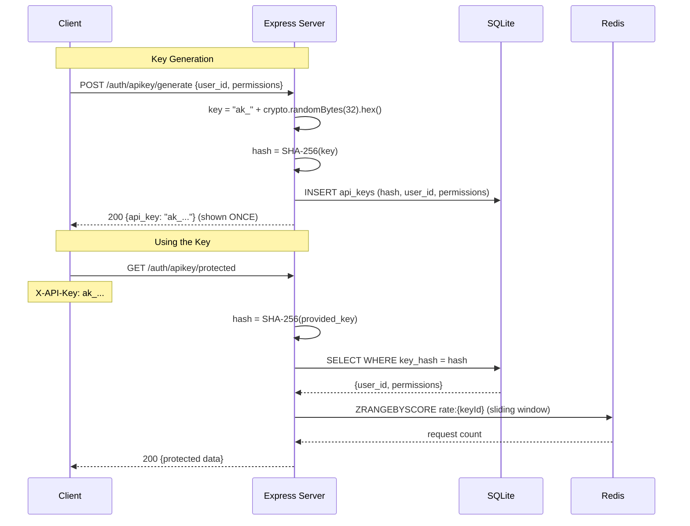

# API Key Authentication

## Flow Diagram

## How It Works

1. **Generation:** Server creates a random 32-byte key, prefixed with `ak_` for easy identification
2. **Hashing:** The key is SHA-256 hashed before storage. The plaintext is shown once and never stored
3. **Verification:** When a key is presented, the server hashes it and looks up the hash. No plaintext comparison
4. **Rate limiting:** Redis sorted set acts as a sliding window counter per key

## Why SHA-256 (not bcrypt)?

- API keys are generated by the server with high entropy (32 random bytes = 256 bits)
- bcrypt is for low-entropy human passwords that need brute-force protection
- SHA-256 is sufficient for high-entropy secrets and is much faster (~microseconds vs ~100ms)
- API keys are checked on every request — bcrypt would be too slow

## Security Notes

- The `ak_` prefix helps developers identify leaked keys in logs and code
- Rate limiting prevents abuse even with a valid key
- Permissions are scoped per key — principle of least privilege
- Keys can be revoked by deleting the hash from the database

## What to Watch Out for in Production

| Concern | Dev (this lab) | Production |
|---------|---------------|------------|
| Key storage | SQLite | PostgreSQL with encryption at rest |
| Rate limiting | Redis sorted set | Redis Cluster or dedicated rate limiter |
| Key rotation | Manual | Automated with expiry dates |
| Logging | Key shown in debug panel | Never log API keys (even partially) |
| Transmission | HTTP | HTTPS only |
| Key prefix | `ak_` | Include environment: `ak_prod_`, `ak_test_` |
