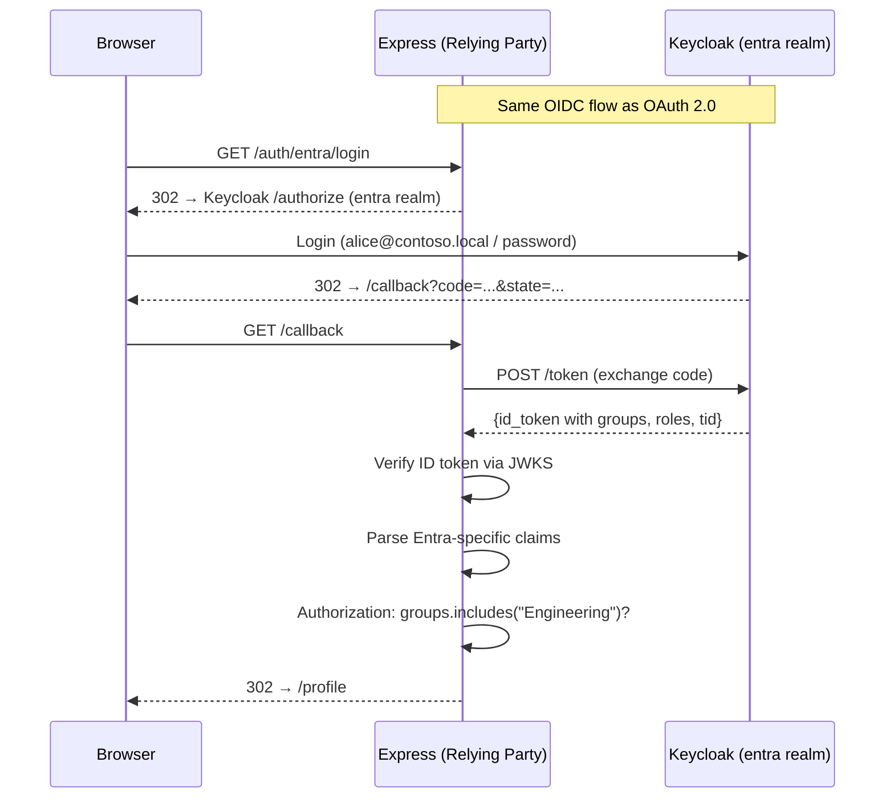

# Entra ID (Azure AD) — Simulated

## Flow Diagram



## What's Different from Standard OIDC?

The protocol is **identical**. The difference is the **claims** in the ID token:

| Claim | Standard OIDC | Entra ID |
|-------|---------------|----------|
| `sub` | User identifier | User identifier |
| `email` | User email | User email |
| `groups` | Not standard | Array of group names/IDs |
| `roles` | Not standard | Array of app role names |
| `tid` | Not standard | Tenant ID (Azure AD tenant) |

## How Groups & Roles Work in Real Entra ID

1. **Groups** are created in Azure AD (e.g., "Engineering", "Finance")
2. Users are assigned to groups
3. The app registration is configured to include groups in the ID token
4. Your code checks `claims.groups.includes("Engineering")` for authorization

**Warning:** For large organizations, groups might come as group IDs (GUIDs), not names. You may need the Microsoft Graph API to resolve names.

## Production Swap

Replace the Keycloak discovery URL:
```
// Dev (this lab)
ENTRA_ISSUER=http://localhost:8080/realms/entra

// Production
ENTRA_ISSUER=https://login.microsoftonline.com/{tenant-id}/v2.0
```

Register the app in the Azure portal, get a client ID/secret, configure group claims. **Your auth code doesn't change** — that's the power of OIDC as a standard.

## Security Notes

- Validate the `tid` claim to ensure the token came from your expected tenant
- Group/role claims are trusted because they come from the signed ID token
- In multi-tenant apps, check `tid` + `aud` to prevent cross-tenant attacks
- Groups can be over-assigned — use the principle of least privilege
