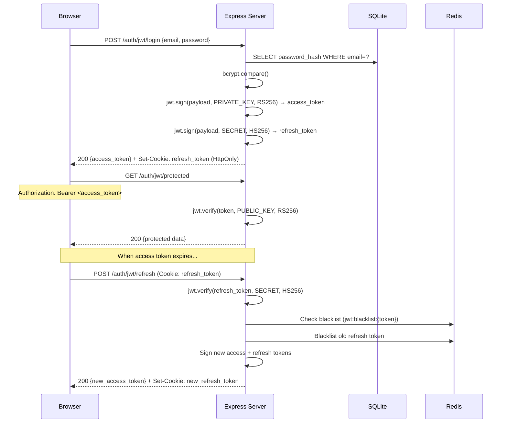

# JWT Authentication

## Flow Diagram

## RS256 vs HS256

| | RS256 (Access Token) | HS256 (Refresh Token) |
|---|---|---|
| **Type** | Asymmetric | Symmetric |
| **Sign with** | Private key | Shared secret |
| **Verify with** | Public key | Same shared secret |
| **Who can verify** | Anyone with the public key | Only the auth server |
| **Use case** | Tokens verified by multiple services | Tokens only handled by auth server |

## Token Rotation

When a refresh token is used, the old one is blacklisted in Redis and a new pair is issued. This limits the damage if a refresh token is stolen — it can only be used once.

## Security Notes

- Access tokens are short-lived (15min) — limits exposure window
- Refresh tokens are in HttpOnly cookies — can't be stolen via XSS
- RS256 lets microservices verify tokens without knowing the signing secret
- Token rotation detects theft: if an attacker uses a stolen refresh token, the legitimate user's next refresh fails (token already used)

## What to Watch Out for in Production

| Concern | Dev (this lab) | Production |
|---------|---------------|------------|
| Key storage | Files on disk | HSM / Vault / KMS |
| Key rotation | Manual | Automated with JWKS endpoint |
| Token storage (client) | In-memory variable | In-memory only (NEVER localStorage) |
| Refresh token cookie | `Secure: false` | `Secure: true` (HTTPS only) |
| Token revocation | Redis blacklist | Redis cluster with TTL |
| Algorithm confusion | Hardcoded RS256 | Always specify algorithm in verify() |
