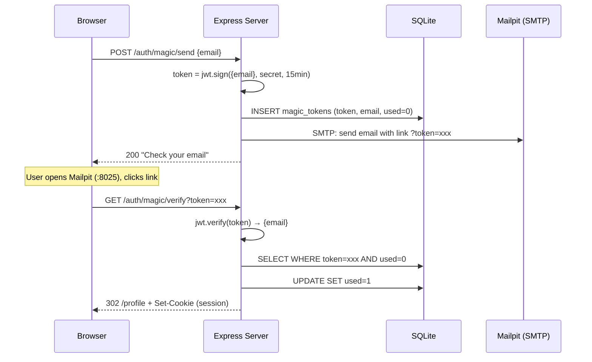

# Magic Link (Passwordless Email)

## Flow Diagram

## How It Works

1. User enters their email — no password
2. Server signs a JWT containing the email (15min expiry)
3. Token is stored in SQLite with `used=0` for single-use enforcement
4. An email is sent via SMTP with a link containing the token
5. User clicks the link, server verifies the JWT signature
6. Server checks `used=0` then sets `used=1` (preventing reuse)
7. A session is created — the user is logged in

## Security Notes

- **Single-use:** Each token can only be used once. Clicking the link a second time fails
- **Short expiry:** 15 minutes limits the window for interception
- **Signed token:** The JWT signature prevents tampering with the email claim
- **No password:** Eliminates password-related attacks (brute force, credential stuffing)
- **Security depends on email:** If someone has access to the user's email, they can log in

## What to Watch Out for in Production

| Concern | Dev (this lab) | Production |
|---------|---------------|------------|
| Email delivery | Mailpit (local catch-all) | SES, Postmark, Resend |
| Token transmission | HTTP | HTTPS only (tokens in URLs are logged by proxies) |
| Rate limiting | None | Limit magic link requests per email per hour |
| Token storage | SQLite | PostgreSQL with cleanup job for expired tokens |
| Phishing risk | N/A | Add fingerprinting (IP, user agent) to link |
| Link format | Query parameter | Consider short-lived redirect through a UUID lookup |
