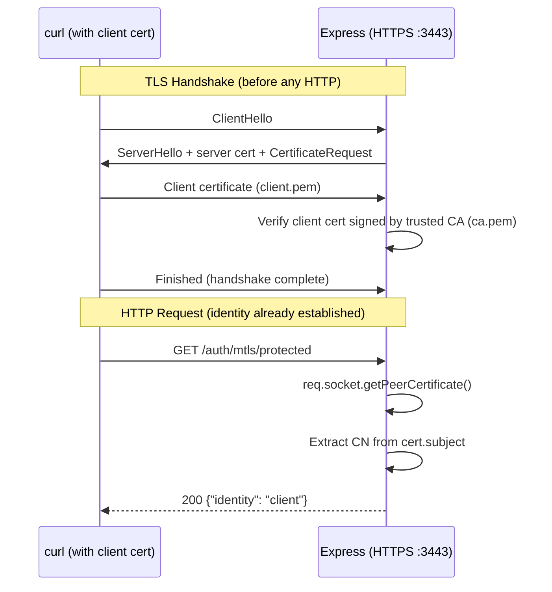

# Mutual TLS (mTLS)

## Flow Diagram



## How It Works

1. **Server starts HTTPS** with `requestCert: true` and a list of trusted CAs
2. **TLS handshake:** Server sends `CertificateRequest` to the client
3. **Client presents its certificate** (must be signed by a trusted CA)
4. **Server verifies** the cert chain: client cert → CA cert
5. **HTTP handler** calls `req.socket.getPeerCertificate()` to read the client identity
6. **No tokens, no cookies, no passwords** — identity is proven at the transport layer

## Certificate Chain

```
     ┌────────────┐
     │  CA (root)  │  ← Both server and client trust this
     │  ca.pem     │
     └─────┬──┬────┘
           │  │
    ┌──────▼──┘──────────┐
    │                     │
┌───▼──────┐    ┌────────▼───┐
│  Server  │    │   Client   │
│server.pem│    │ client.pem │
└──────────┘    └────────────┘
```

## When to Use mTLS

- **Service-to-service** communication (microservices, APIs)
- **IoT devices** authenticating to servers
- **Zero-trust networks** where every connection must prove identity
- **Financial/healthcare** systems with strict compliance requirements
- NOT for end-user browser authentication (complex UX)

## Security Notes

- Certificate-based auth is stronger than passwords/tokens — no secrets transmitted
- The private key never leaves the client machine
- Certificate revocation (CRL/OCSP) is critical in production
- mTLS provides **mutual** authentication: both sides verify each other

## What to Watch Out for in Production

| Concern | Dev (this lab) | Production |
|---------|---------------|------------|
| CA | Self-signed | Internal PKI or commercial CA |
| Certificate management | Manual OpenSSL | HashiCorp Vault, cert-manager, SPIFFE |
| Revocation | None | CRL distribution point or OCSP responder |
| Certificate rotation | Manual | Automated with short-lived certs (hours, not years) |
| TLS termination | Node.js directly | Load balancer (nginx, envoy) forwards cert headers |
| Client deployment | curl flags | Certs bundled in service containers |
