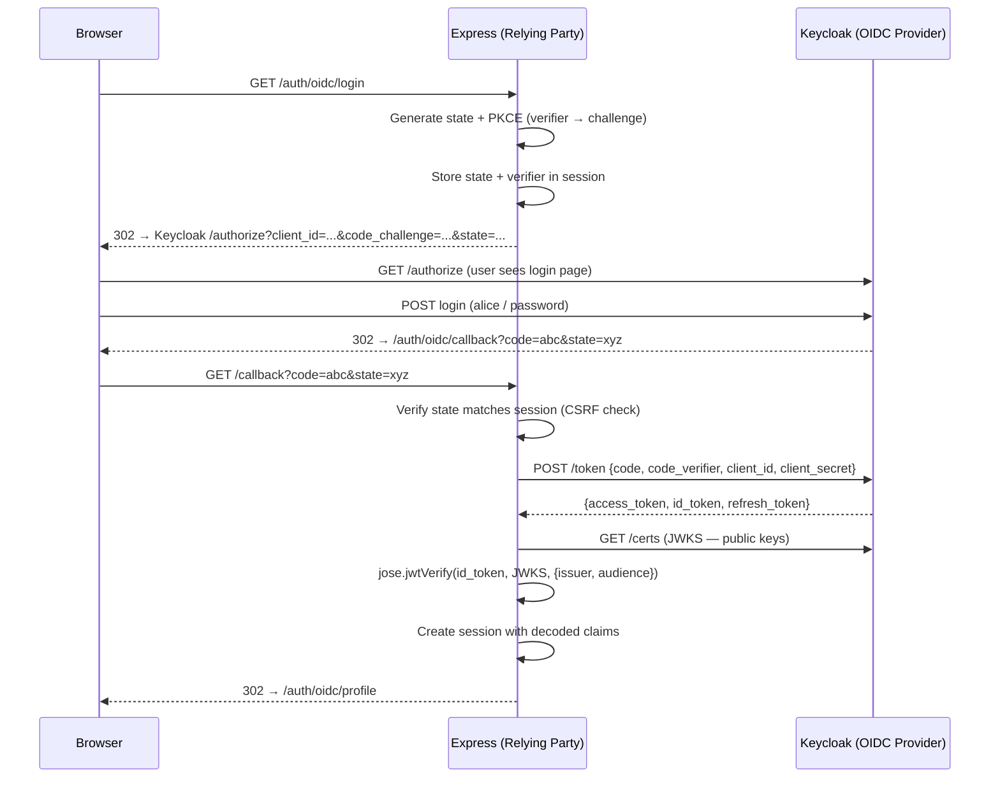

# OAuth 2.0 / OpenID Connect

## Flow Diagram

## Key Concepts

### PKCE (Proof Key for Code Exchange)
- **Problem:** Authorization codes can be intercepted (especially in mobile/SPA flows)
- **Solution:** Client generates a random `code_verifier`, sends SHA-256 hash as `code_challenge` to /authorize
- **At token exchange:** Client sends the original `code_verifier`. IdP verifies SHA-256(verifier) == challenge
- **Result:** Even if the code is intercepted, it's useless without the verifier

### State Parameter
- Random value stored in session, sent to IdP, verified on callback
- Prevents CSRF: an attacker can't forge a callback with a valid state

### ID Token Verification
- The ID token is a JWT signed by Keycloak's private key
- We fetch Keycloak's public keys (JWKS) and verify the signature
- We also check: issuer matches, audience matches, token not expired

## Security Notes

- Always use PKCE — even for confidential clients (defense in depth)
- Never trust the ID token without verifying the signature
- Store tokens in the session (server-side), not in the browser
- The `nonce` parameter (not implemented here for simplicity) prevents token replay

## What to Watch Out for in Production

| Concern | Dev (this lab) | Production |
|---------|---------------|------------|
| IdP | Keycloak (local Docker) | Google, GitHub, Okta, Auth0 |
| Discovery URL | `http://localhost:8080/realms/oidc` | Provider's HTTPS URL |
| Client secret | Hardcoded | Env var / secrets manager |
| Token storage | Session (Redis) | Session or encrypted cookie |
| PKCE | S256 | S256 (always — plain is insecure) |
| Nonce | Not used | Add nonce to prevent replay |
