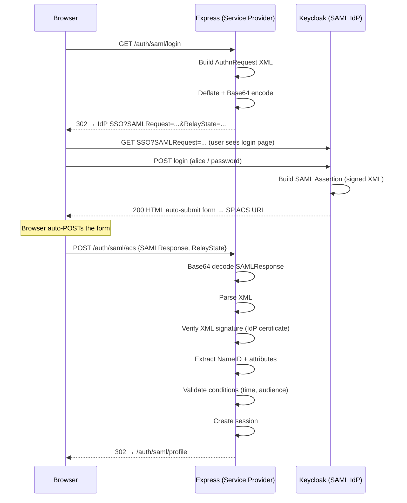

# SAML 2.0

## Flow Diagram

## SAML Terminology

| Term | Meaning |
|------|---------|
| **SP (Service Provider)** | Your application — requests authentication |
| **IdP (Identity Provider)** | Keycloak — authenticates users |
| **AuthnRequest** | XML document from SP asking IdP to authenticate a user |
| **SAMLResponse** | XML document from IdP containing the authentication result |
| **Assertion** | The core of the response — contains identity + attributes |
| **ACS (Assertion Consumer Service)** | SP endpoint that receives the SAMLResponse |
| **NameID** | Primary user identifier in the assertion |
| **RelayState** | Opaque value echoed back to correlate request/response |

## SAML vs OIDC

| | SAML 2.0 | OIDC |
|---|---|---|
| **Format** | XML | JSON (JWT) |
| **Transport** | POST (form auto-submit) or Redirect | Redirect + backchannel |
| **Token size** | Large (XML + signature) | Small (compact JWT) |
| **Signing** | XML Digital Signatures (complex) | JWS (simpler) |
| **Discovery** | Metadata XML | .well-known/openid-configuration |
| **Era** | 2005 (enterprise) | 2014 (modern web) |
| **Still used?** | Yes (enterprise, legacy) | Yes (new applications) |

## Security Notes

- **ALWAYS verify the XML signature** — without it, anyone can forge assertions
- The signature uses X.509 certificates, not symmetric secrets
- Check `NotBefore` and `NotOnOrAfter` conditions to prevent replay
- Check `Audience` matches your SP entity ID
- SAML is vulnerable to XML signature wrapping attacks — use a well-tested library

## What to Watch Out for in Production

| Concern | Dev (this lab) | Production |
|---------|---------------|------------|
| Signature verification | Skipped for readability | MANDATORY — use `passport-saml` or `saml2-js` |
| IdP certificate | From Keycloak metadata | Exchange production certs |
| SP metadata | Not published | Host at `/saml/metadata` for IdP import |
| Encryption | Assertions not encrypted | Encrypt assertions in transit |
| XML parsing | Basic xml2js | Use a SAML-specific parser with security hardening |
| Replay protection | None | InResponseTo + assertion ID tracking |
